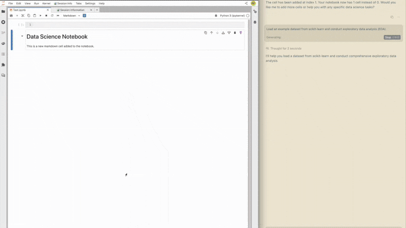
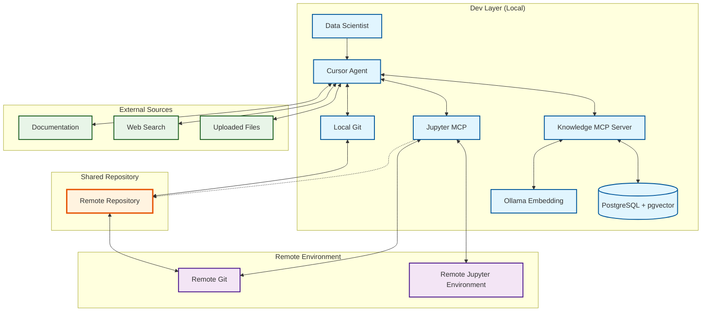

# DS Agentic Workflow


*Demonstrating autonomous exploratory data analysis with real-time execution and intelligent error resolution*

A comprehensive data science agentic workflow system powered by Cursor AI and two specialized Model Context Protocol (MCP) servers. This system transforms traditional data science development by enabling truly autonomous workflows that bridge local development environments and remote compute resources, with intelligent knowledge management and automated notebook execution capabilities.

## 🚨 The Problem: Data Science Development Friction

After working with Cursor on various DS projects, we identified two critical gaps that prevent truly agentic data science workflows:

### Problem 1: The Remote Execution Barrier 🚧

**The Reality**: DS data processing and model training happen on remote environments—Spark clusters for big data, GPU instances for deep learning, high-memory machines for large datasets.

**The Limitation**: Cursor runs locally on your laptop. There's no seamless way for the Cursor agent to:
- Develop and debug code directly in remote Jupyter notebooks
- Execute computationally intensive operations on cloud resources
- Stream real-time results back from remote environments
- Handle the complexity of Jupyter kernel connections, environment management, and resource monitoring

**The Pain**: You're constantly context-switching—write code locally, push to remote, connect via browser, debug, rinse and repeat. The AI agent can't follow you into the remote environment where the real work happens.

### Problem 2: The Memory Gap 🧠

**The Reality**: DS work follows predictable patterns—exploratory data analysis, feature engineering experiments, model comparison workflows, debugging common errors.

**The Limitation**: Every project starts from scratch. There's no permanent memory service that can:
- Store and retrieve successful analysis patterns
- Remember debugging solutions for common errors
- Learn from previous model experiments and recommend approaches
- Maintain team knowledge that transcends individual sessions

**The Pain**: You're constantly re-solving the same problems. That brilliant debugging insight from last month? Lost. The optimal feature engineering approach for similar datasets? Forgotten. The agent can't learn and accumulate expertise over time.

## 💡 Our Solution: Two MCP Servers for Agentic DS

Realizing these gaps, we built **two specialized MCP servers** that transform Cursor into a truly autonomous data science development environment:

## 🏗️ Architecture Overview

The DS Agentic Workflow consists of two core MCP servers that work together to provide a complete data science development experience:

### 🔧 Core MCP Servers

#### 1. **Jupyter MCP Server** - Solving the Remote Execution Barrier 🤖

**The Problem It Solves**: Bridging the gap between local Cursor development and remote computational environments.

**What it enables the Cursor agent to do**:
- **Direct Remote Jupyter Control**: Execute code cells directly in remote Jupyter notebooks
- **Real-time Streaming**: Get live feedback from Spark jobs, GPU training, and long-running computations
- **Seamless Environment Management**: Handle Jupyter kernel connections, session management, and resource monitoring automatically
- **Git Synchronization**: Execute git commands on remote environment through Python/Bash code sent via MCP
- **Resource Optimization**: Monitor CPU, memory, and GPU usage to optimize performance

#### 2. **Knowledge MCP Server** - Solving the Memory Gap 🧠

**The Problem It Solves**: Creating persistent memory for DS patterns, solutions, and accumulated expertise.

**What it enables the Cursor agent to do**:
- **Pattern Recognition**: Store and retrieve successful EDA approaches, feature engineering techniques, and model architectures
- **Error Solution Memory**: Remember debugging solutions for common data science errors (memory issues, dtype problems, convergence failures)
- **Semantic Search**: Find similar problems and proven solutions using vector embeddings
- **Team Knowledge Sharing**: Build collective expertise that transcends individual developers
- **Intelligent Recommendations**: Suggest approaches based on accumulated experience

### 🌟 The Agentic Flow - How They Work Together 🎯

When combined, these servers enable a completely autonomous DS workflow where the Cursor agent can:

1. **Research Phase**: Query knowledge base for similar problems and proven approaches
2. **Planning Phase**: Decompose complex analysis tasks into executable steps
3. **Execution Phase**: Run computationally intensive work on remote resources
4. **Debug Phase**: Apply accumulated debugging patterns when errors occur
5. **Learning Phase**: Store new insights and successful patterns for future use

**The Result**: You work at the strategic level while the agent handles the operational complexity.

## 🔄 System Architecture

The DS Agentic Workflow integrates multiple layers to provide a seamless data science development experience:



### 🎯 Workflow Components

#### **1. Local Development Layer**
- **Data Scientist**: Interacts with Cursor agent for data science tasks
- **Cursor Agent**: Agent-powered orchestration of the entire workflow
- **Local Git**: Version control for local development
- **Jupyter MCP**: Interface to remote Jupyter environments
- **Knowledge MCP**: Knowledge storage with semantic search using embeddings
- **PostgreSQL + pgvector**: Vector database for embeddings and knowledge storage
- **Ollama Embedding**: Local embeddings service for semantic search

#### **2. Remote Execution Layer**
- **Remote Jupyter Environment**: Powerful compute resources for data processing
- **Remote Git**: Synchronized code repository in remote environment
- **Session Tracking**: Real-time monitoring of notebook state and execution

#### **3. Knowledge Integration**
- **External Sources**: Documentation, web search, and uploaded files
- **Semantic Search**: Agent-powered knowledge retrieval using vector embeddings
- **Pattern Recognition**: Automated identification of similar problems and solutions

## 🚀 Getting Started

### Prerequisites

- **Python 3.8+** with conda environment management
- **PostgreSQL** with pgvector extension
- **Ollama** for local embeddings service
- **Cursor agent** editor with MCP support
- **Remote Jupyter Environment** (optional but recommended)

### Quick Setup

1. **Clone the repository**:
```bash
git clone <repository-url>
cd ds-agentic-workflow
```

2. **Set up Knowledge MCP**:
```bash
cd mcp-servers/knowledge-mcp
pip install -r requirements.txt
# Configure PostgreSQL and Ollama (see knowledge-mcp/README.md)
```

3. **Set up Jupyter MCP**:
```bash
cd ../jupyter-mcp
pip install -r requirements.txt
# Configure environment tokens (see jupyter-mcp/README.md)
```

4. **Configure Cursor MCP**:
```json
{
  "mcpServers": {
    "knowledge-mcp": {
      "command": "python",
      "args": ["main.py"],
      "cwd": "/absolute/path/to/knowledge-mcp"
    },
    "jupyter-mcp": {
      "command": "/opt/anaconda3/envs/py310/bin/python3",
      "args": ["/absolute/path/to/jupyter-mcp/main.py"],
      "env": {
        "LOCAL_JUPYTER_TOKEN": "<your-local-token>",
        "REMOTE_JUPYTER_TOKEN": "<your-remote-token>"
      }
    }
  }
}
```

## 🔄 The Autonomous Development and Debugging Loop

This system transforms the existing development workflow from manual context-switching to fully autonomous operation:

```mermaid
flowchart TD
    subgraph "❌ Before Integration"
        T1[Manual Research<br/>Google, Stack Overflow]
        T2[Local Development<br/>Limited Resources]
        T3[Manual Remote Sync<br/>Git Push/Pull/Browser]
        T4[Manual Debugging<br/>Repetitive Patterns]
        T5[Lost Knowledge<br/>Individual Silos]
        
        T1 --> T2 --> T3 --> T4 --> T5
        T5 -.->|Context Lost| T1
    end
    
    subgraph "✅ After Integration"
        A1[Knowledge Search<br/>Automated Research]
        A2[Remote Planning<br/>Resource Optimization]
        A3[Seamless Execution<br/>Real-time Streaming]
        A4[Pattern Recognition<br/>Auto-fixing]
        A5[Knowledge Storage<br/>Shared Learning]
        
        A1 --> A2 --> A3 --> A4 --> A5
        A5 -->|Enhanced Expertise| A1
        
        subgraph "🧠 Knowledge Loop"
            K1[Search Similar<br/>Problems]
            K2[Apply Proven<br/>Solutions]
            K3[Store New<br/>Insights]
            
            K1 --> K2 --> K3 --> K1
        end
        
        A1 <--> K1
        A4 <--> K2
        A5 <--> K3
    end
    
    style T1 fill:#ffcdd2
    style T2 fill:#ffcdd2
    style T3 fill:#ffcdd2
    style T4 fill:#ffcdd2
    style T5 fill:#ffcdd2
    
    style A1 fill:#c8e6c9
    style A2 fill:#c8e6c9
    style A3 fill:#c8e6c9
    style A4 fill:#c8e6c9
    style A5 fill:#c8e6c9
    
    style K1 fill:#e1f5fe
    style K2 fill:#e1f5fe
    style K3 fill:#e1f5fe
```



### Phase 1: Intelligent Research & Context Building
**Before Integration**: Agent lacks DS-specific tools, cannot access remote environments and historical knowledge
**After Integration**: Agent queries knowledge base, synthesizes historical experience, automatically builds comprehensive context

### Phase 2: Intelligent Planning & Code Generation
**Before Integration**: Agent plans based on current context, cannot utilize past DS best practices
**After Integration**: Agent calls past successful experiences, generates proven optimized code

### Phase 3: Seamless Remote Execution
**Before Integration**: Agent can only develop locally, requires manual switching to remote environment for execution
**After Integration**: Agent directly controls remote Jupyter, seamlessly executes large-scale computations

### Phase 4: Intelligent Error Resolution
**Before Integration**: Agent re-analyzes errors each time, cannot utilize past DS solutions
**After Integration**: Agent retrieves similar historical error solutions, quickly locates and fixes issues

### Phase 5: Continuous Learning & Knowledge Storage
**Before Integration**: DS experience is lost after sessions end, cannot accumulate across projects
**After Integration**: Automatically stores successful patterns and solutions, forming a growing knowledge base

## 🎯 Real-World Use Cases

### Scenario 1: Large-Scale Feature Engineering
**You**: *"Analyze the customer transaction dataset in s3://xxx/xx and engineer features for churn prediction."*

**What happens autonomously**:
1. **Knowledge MCP** searches for similar feature engineering solutions
2. **Jupyter MCP** sends code to remote Jupyter environment (Spark servers) for execution
3. Agent applies proven feature engineering techniques from knowledge base
4. Results stream back in real-time with progress updates
5. New successful patterns get stored for future projects

### Scenario 2: Model Experimentation Workflow
**You**: *"Compare XGBoost, Random Forest, and Neural Network performance on this dataset."*

**What happens autonomously**:
1. **Knowledge MCP** retrieves optimal hyperparameters from similar projects
2. **Jupyter MCP** sends training code to remote Jupyter environment with GPU/Spark resources
3. Agent handles cross-validation, metric calculation, and visualization
4. Best practices and optimal configurations get stored automatically

### Scenario 3: Debugging Complex Data Issues
**You**: *"This memory error keeps occurring when loading the dataset."*

**What happens autonomously**:
1. **Jupyter MCP** captures the full error context from remote environment
2. **Knowledge MCP** searches for similar memory error patterns
3. Agent applies proven solutions (chunking, dtype optimization, lazy loading)
4. If successful, the solution gets stored for future automatic application

## 📊 MCP Server Details

### Jupyter MCP (`mcp-servers/jupyter-mcp/`)
- **Purpose**: Remote Jupyter notebook execution and management
- **Key Features**: Code execution, EDA automation, git integration, kernel management
- **Technology**: FastMCP, Jupyter Kernel Client, NbModel Client
- **See**: [jupyter-mcp/README.md](mcp-servers/jupyter-mcp/README.md)

### Knowledge MCP (`mcp-servers/knowledge-mcp/`)
- **Purpose**: Knowledge storage and semantic search with vector embeddings
- **Key Features**: Vector search, markdown knowledge storage, hybrid search, agent-powered recommendations
- **Technology**: FastMCP, PostgreSQL, pgvector, Ollama embeddings
- **See**: [knowledge-mcp/README.md](mcp-servers/knowledge-mcp/README.md)

## 📋 Cursor Agent Rules

When using this DS Agentic Workflow with Cursor, add these rules for optimal integration:

```
You have access to two MCP servers: `knowledge-mcp` and `jupyter-mcp`. Use `knowledge-mcp` for additional context related to Spark or database tables. For matters specifically related to Jupyter notebooks, utilize `jupyter-mcp`.

MANDATORY SEARCH-FIRST WORKFLOW:
BEFORE executing any technical action, you MUST:
1. Search the knowledge base using relevant queries covering:
   - "Solution to [specific issue]" or "Best practice for [specific task]"
   - "How to [technical operation] in [context]"
   - "Debugging [symptom] in [environment]"
2. Review existing solutions and apply known patterns if available
3. Only proceed with custom solutions if no relevant knowledge exists

DECISION PATH AFTER SEARCH:
- 📚 Relevant knowledge found → Apply existing solution/pattern
- 🔍 Partial knowledge found → Use as foundation, extend with investigation
- ❌ No relevant knowledge → Proceed with investigation, document solution

WHEN TO STORE KNOWLEDGE:
Store when you have: successfully resolved complex issues, discovered non-obvious solutions, found debugging patterns, implemented architectural improvements, or identified common pitfalls.

STORAGE FORMAT:
Title: "Solution to [SPECIFIC_PROBLEM]" or "Best Practice for [SPECIFIC_TASK]"
Content Structure:
## Symptoms That Trigger This Solution
## Quick Diagnosis Steps
## Implementation Steps
## Common Mistakes to Avoid
## Verification Steps
## Related Knowledge
Tags: [technical-component, symptom-type, solution-category]

TECHNICAL SETUP:
- When executing python/jupyter in terminal, switch to py310 environment:
  `conda deactivate && CONDA_SHLVL=0 conda activate py310`

JUPYTER CONNECTION RULES:
- When the user provides connection_info (typically as JSON with fields like timestamp, jupyterlabVersion, currentWidget, notebookPath, sessionName, kernelId, kernelName, kernelState), you MUST pass it EXACTLY as provided to jupyter-mcp tools without any modification, parsing, or field changes
- DO NOT attempt to transform, extract, or modify any fields from the provided connection_info
- DO NOT create custom connection objects or modify the structure
- Pass the entire connection_info object directly as the connection_info parameter

STORAGE LIMIT: Ensure each knowledge document stays within 7,000 words due to BGE embedding model token limits. For long context models like Qwen3 Embedding, this limit can be adjusted accordingly.
```

## 🤝 Contributing

We welcome contributions to improve the DS Agentic Workflow system! Please see individual MCP server README files for specific contribution guidelines.

### Development Workflow
1. Fork the repository
2. Create feature branches for each MCP server
3. Test locally with both servers running
4. Submit pull requests with comprehensive descriptions


## 🙏 Acknowledgments

This project was inspired by and builds upon the excellent work from [Datalayer's Jupyter MCP Server](https://github.com/datalayer/jupyter-mcp-server). We've extended their foundational approach with additional tools and capabilities specifically designed for data science workflows.

### Key Extensions and Innovations

- **📊 Enhanced EDA Support**: Added comprehensive exploratory data analysis tools with AI-guided templates and automated recommendations
- **🔄 Multi-Notebook Session Management**: Developed [Jupyter Session Tracer](https://github.com/wenmin-wu/jupyter-session-tracer) extension to enable multiple Cursor windows to connect to different remote notebooks simultaneously
- **🛠️ Extended Tool Suite**: Added advanced features like automated variable inspection, resource monitoring, and Git integration
- **🎯 Data Science Focus**: Specialized tools for common DS tasks including model comparison, feature engineering, and statistical analysis
- **🚀 Production-Ready Features**: Added support for complex multi-environment workflows and team collaboration
- **🧠 Knowledge Management**: Integrated semantic knowledge storage and retrieval system for accumulated expertise

The [Jupyter Session Tracer](https://github.com/wenmin-wu/jupyter-session-tracer) extension was specifically developed to support the unique requirements of multiple developers or multiple analysis sessions, allowing seamless switching between different remote notebooks without connection conflicts.

## 📄 License

This project is licensed under the MIT License - see the LICENSE file for details.
