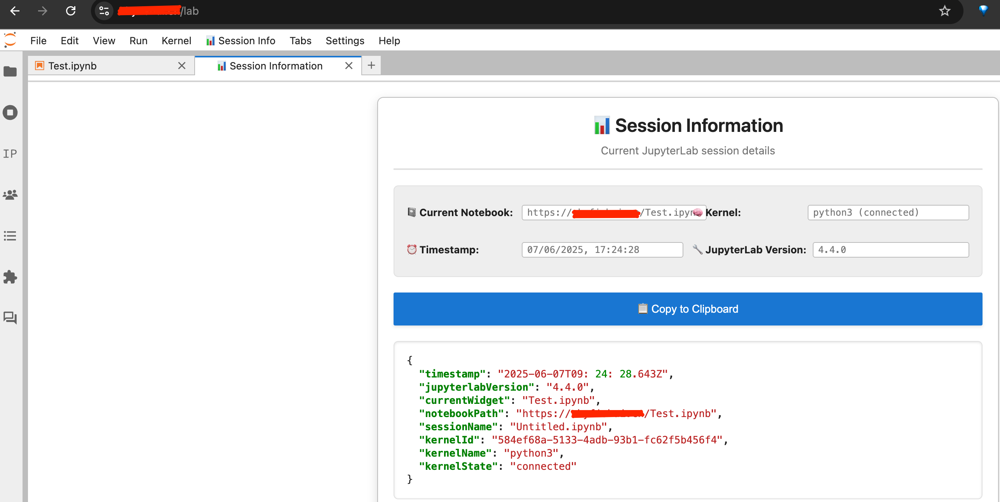
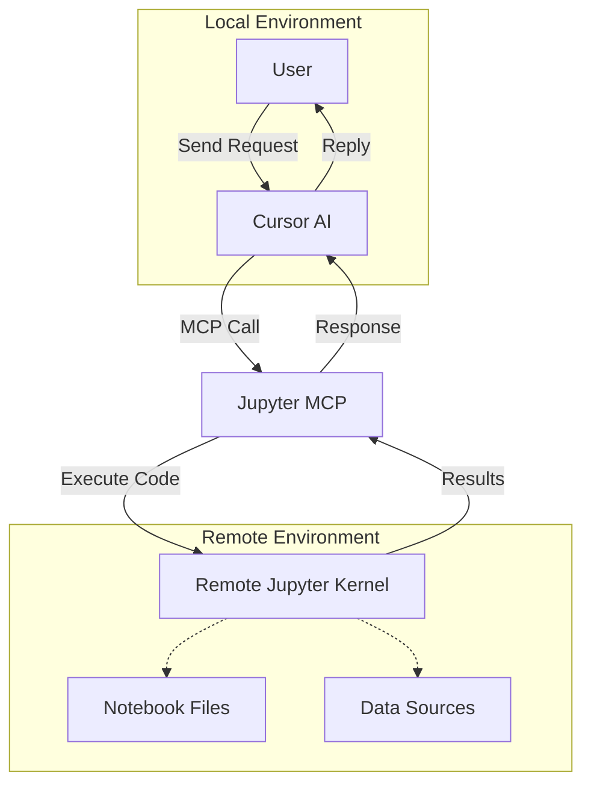

# Jupyter MCP

A powerful Model Context Protocol (MCP) server that enables Cursor AI to directly interact with Jupyter notebooks running in remote environments. This tool bridges the gap between your local development environment and remote compute resources, allowing seamless notebook-based data science workflows.

## 🚀 Key Features

- **Real-time Notebook Execution**: Execute code cells directly in remote Jupyter notebooks with live results
- **Comprehensive EDA Support**: Automated exploratory data analysis with AI-guided templates and recommendations
- **Git Integration**: Seamless code synchronization between local and remote environments
- **Multi-Server Support**: Automatically handles different Jupyter server configurations (local, remote sandbox)
- **Intelligent Variable Inspection**: Monitor and inspect variables in the remote kernel namespace
- **Resource Management**: Monitor CPU, memory, and system resources on remote servers
- **Kernel Management**: Restart, interrupt, and manage remote kernel sessions
- **Cell Management**: Add, execute, update, and delete notebook cells programmatically

## 🎯 Use Cases

### 1. **Automated Exploratory Data Analysis (EDA)**
```python
# The agent can automatically:
# - Load datasets from various sources (located on remote server, s3)
# - Generate comprehensive data quality reports
# - Create visualization dashboards
# - Perform statistical analysis
# - Identify data patterns and anomalies
```

**Example Workflow:**
- "Analyze the customer_data.csv file and create a comprehensive EDA report"
- Agent automatically loads data, checks quality, creates visualizations, and documents findings
- Results appear in real-time in your remote notebook

### 2. **Iterative Model Development**
```python
# Seamless model experimentation:
# - Test different algorithms and hyperparameters
# - Compare model performance metrics
# - Visualize training progress
# - Save and version model artifacts
```

**Example Workflow:**
- "Build and compare multiple ML models for this classification task"
- Agent creates model comparison notebook with cross-validation, metrics, and visualizations

### 3. **Remote Debugging and Development**
```python
# Debug code running on powerful remote machines:
# - Inspect variables and data structures
# - Step through complex data processing pipelines
# - Monitor resource usage during heavy computations
# - Fix issues without leaving your local environment
```

### 4. **Collaborative Data Science**
```python
# Enhanced team collaboration:
# - Share live notebook sessions
# - Document analysis steps with markdown
# - Create reproducible workflows
# - Maintain version control integration
```

### 5. **Large-Scale Data Processing**
```python
# Handle big data workloads:
# - Process datasets too large for local machines
# - Leverage distributed computing resources
# - Monitor long-running computations
# - Automatically handle memory management
```

### 6. **Educational and Training Scenarios**
```python
# Create interactive learning experiences:
# - Generate step-by-step tutorial notebooks
# - Provide AI-guided data science workflows
# - Create exercises with automated solutions
# - Build comprehensive documentation
```

## 📊 EDA Capabilities

The tool includes sophisticated EDA features:

- **Automated Data Profiling**: Instant data quality assessment and summary statistics
- **Smart Visualizations**: Context-aware chart generation based on data types
- **Statistical Analysis**: Automated hypothesis testing and correlation analysis
- **Missing Data Analysis**: Comprehensive missing value pattern detection
- **Outlier Detection**: Multiple methods for anomaly identification
- **Feature Engineering**: Automated feature importance and relationship analysis

## Setup

### Local Environment
1. **Clone the repository:**
```bash
git clone <your-repository-url>
cd jupyter-mcp
```

2. **Install dependencies:**
```bash
pip install -r requirements.txt
```

3. **Configure Cursor MCP settings:**
```json
{
    "jupyter-mcp": {
        "command": "/opt/anaconda3/envs/py310/bin/python3",
        "args": [
            "/Users/your-username/path/to/jupyter-mcp/main.py"
        ],
        "env": {
            "LOCAL_JUPYTER_TOKEN": "<your-local-jupyter-token>",
            "REMOTE_JUPYTER_TOKEN": "<your-remote-jupyter-token>",
            "LOG_LEVEL": "INFO"
        }
    }
}
```

4. **Add to Cursor's rules:**
```
You have access to the `jupyter-mcp` MCP server for Jupyter notebook operations and execution.

TECHNICAL SETUP:
- When executing python/jupyter in terminal, switch to py310 environment:
  `conda deactivate` then `CONDA_SHLVL=0 conda activate py310`

ENVIRONMENT VARIABLES:
- Set LOCAL_JUPYTER_TOKEN for localhost Jupyter servers
- Set REMOTE_JUPYTER_TOKEN for any remote Jupyter servers
- The tool automatically selects the correct token based on hostname

JUPYTER CONNECTION RULES:
- When the user provides connection_info (typically as JSON with fields like timestamp, jupyterlabVersion, currentWidget, notebookPath, sessionName, kernelId, kernelName, kernelState), you MUST pass it EXACTLY as provided to jupyter-mcp tools without any modification, parsing, or field changes
- DO NOT attempt to transform, extract, or modify any fields from the provided connection_info
- DO NOT create custom connection objects or modify the structure
- Pass the entire connection_info object directly as the connection_info parameter
```

### Remote Sandbox Configuration
1. **Update bootstrap script** (`/workspace/.bootstrap/bootstrap.sh`):
```bash
pip install --ignore-installed jupyter-collaboration
pip install jupyterlab==4.4.0 notebook msgpack jupyter-session-tracer==0.1.2
```

2. **Recreate your sandbox environment** to see the new session tracer tab:


3. **Copy the connection info** and provide it to Cursor for seamless integration:

📹 **Demo Video**: [Watch the complete workflow in action](https://github.com/user-attachments/assets/aa9b07eb-13a1-4d68-a493-961db0cc79cc)

> **Note**: Click the link above to download and watch the demo video showing the complete jupyter-mcp workflow.

## 🔧 Advanced Features

### Token Management
The tool automatically selects the appropriate Jupyter token based on your server:
- **Local servers** (localhost:*): Uses `LOCAL_JUPYTER_TOKEN`
- **Remote servers** (any non-localhost domain): Uses `REMOTE_JUPYTER_TOKEN`

### Resource Monitoring
Monitor your remote environment's performance:
```python
# Check CPU, memory, and disk usage
# Monitor YARN resources (if available)
# Track kernel performance and health
```

### Git Integration
Seamless version control integration:
```python
# Push local changes to remote
# Pull updates from remote repositories
# Automatic conflict resolution
# Branch management and synchronization
```

## 📝 Example Workflows

### Quick EDA Example
```bash
# Just provide your dataset path and analysis goal
"Analyze data stored in s3://grab-stg/mart/orders/2025 focusing on seasonal trends and customer segmentation"
```

### Model Development Pipeline
```bash
# End-to-end ML pipeline
"Load the titanic dataset, perform EDA, build multiple classification models, and compare their performance"
```

### Data Processing Workflow
```bash
# Complex data transformation
"Process the raw sensor data, clean outliers, perform feature engineering, and prepare for time series analysis"
```

## 🙏 Acknowledgments

This project was inspired by and builds upon the excellent work from [Datalayer's Jupyter MCP Server](https://github.com/datalayer/jupyter-mcp-server). We've extended their foundational approach with additional tools and capabilities specifically designed for data science workflows.

### Key Extensions and Innovations

- **📊 Enhanced EDA Support**: Added comprehensive exploratory data analysis tools with AI-guided templates and automated recommendations
- **🔄 Multi-Notebook Session Management**: Developed [Jupyter Session Tracer](https://github.com/wenmin-wu/jupyter-session-tracer) extension to enable multiple Cursor windows to connect to different remote notebooks simultaneously
- **🛠️ Extended Tool Suite**: Added advanced features like automated variable inspection, resource monitoring, and Git integration
- **🎯 Data Science Focus**: Specialized tools for common DS tasks including model comparison, feature engineering, and statistical analysis
- **🚀 Production-Ready Features**: Added support for complex multi-environment workflows and team collaboration

The [Jupyter Session Tracer](https://github.com/wenmin-wu/jupyter-session-tracer) extension was specifically developed to support the unique requirements of multiple developers or multiple analysis sessions, allowing seamless switching between different remote notebooks without connection conflicts.

## 🤝 Contributing

We welcome contributions! Please see our contribution guidelines and feel free to submit issues or pull requests.


